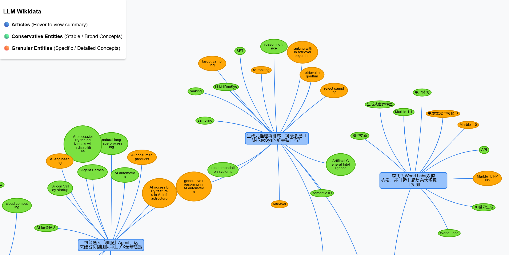

# LLM Wikidata Pipeline

[English](README_EN.md) | [中文](README.md)

Inspired by Karpathy's LLM Wiki, this is a project based on large language models (LLMs) that automatically comprehends documents and transforms them into a knowledge graph. Hence, it is named LLM Wikidata.

The core concept is to address the issue of LLMs struggling with large-scale entity linking. It utilizes the ChromaDB vector database to recall existing entities, preventing the model from generating a large number of identical or highly similar entities.

> 

## Prerequisites & Installation

1. **Clone the Repository**:
   ```bash
   git clone https://github.com/QipengGuo/llm-wikidata.git
   cd llm-wikidata
   ```

2. **Install Dependencies**:
   ```bash
   pip install -r requirements.txt
   ```

## Configuration Guide

This project separates sensitive configurations (like API Keys) from the code.

1. Copy the configuration template:
   ```bash
   cp config.example.py config.py
   ```

2. Edit `config.py` and fill in your API Key and base URL (supports any LLM API compatible with the OpenAI SDK):
   ```python
   # Your Model API Key
   API_KEY = "your_api_key_here"
   
   # Other configurations like base URL and model name can be modified as needed
   ```

## Usage Instructions

### 1. Run the Pipeline
The main entry point is `main.py`, which reads data from `data/articles_content.jsonl` for processing by default.
> **Note**: `data/articles_content.jsonl` contains 100 articles selected from the "机器之心" official account as an example dataset for quick trial.

- **Real LLM Mode (Default)**: Calls the real LLM API configured in your config file for text extraction and graph construction.
  ```bash
  python main.py
  ```

- **Mock Mode**: Does not call the real LLM API, suitable for fast local debugging when no API key is available.
  ```bash
  python main.py --mock
  ```
  *(Optional: You can limit the number of processed articles with `--limit 5`)*

Once finished, the results will be saved in `data/pipeline_results.jsonl`.

### 2. Generate the Visualization Graph
After the pipeline finishes running, you can generate a standalone interactive graph page.

```bash
python visualize.py
```
This will generate a `graph.html` file in the `data/` directory. Simply open it with your browser to view the graph.
> **Note**: This repository already includes a pre-generated `data/graph.html` based on the example dataset. You can directly download or open it in your browser to preview the final visualization effect.

### 3. Database Management
You can easily manage the underlying ChromaDB database using `db_manager.py`:

- **Export Database**: `python db_manager.py export --file data/db_export.jsonl`
- **Import Database**: `python db_manager.py import --file data/db_export.jsonl`
- **Clear Database**: `python db_manager.py clear`

## Project Structure

```text
├── config.example.py    # Configuration file template
├── main.py              # Main pipeline entry point
├── visualize.py         # Knowledge graph HTML visualization generator
├── db_manager.py        # Vector database management tool
├── requirements.txt     # Project dependencies
├── src/                 # Core code directory
│   ├── models.py        # Pydantic data model definitions
│   ├── pipeline.py      # Core logic for extraction, alignment, etc.
│   ├── vector_store.py  # ChromaDB wrapper
│   └── llm_service.py   # LLM service wrapper (supports Mock and Real)
└── data/                # Data storage directory (mostly ignored by Git)
    ├── articles_content.jsonl  # Raw article data (example)
    └── chroma_db/              # ChromaDB local persistence directory
```

## Notes

- The program includes built-in data validation and will automatically skip invalid data, such as missing titles, empty content, or content that is too short.
- The generated `graph.html` includes automatic layout functionality based on a physics engine. To improve the user experience, the layout automatically freezes node positions once stabilized to prevent continuous jittering.
